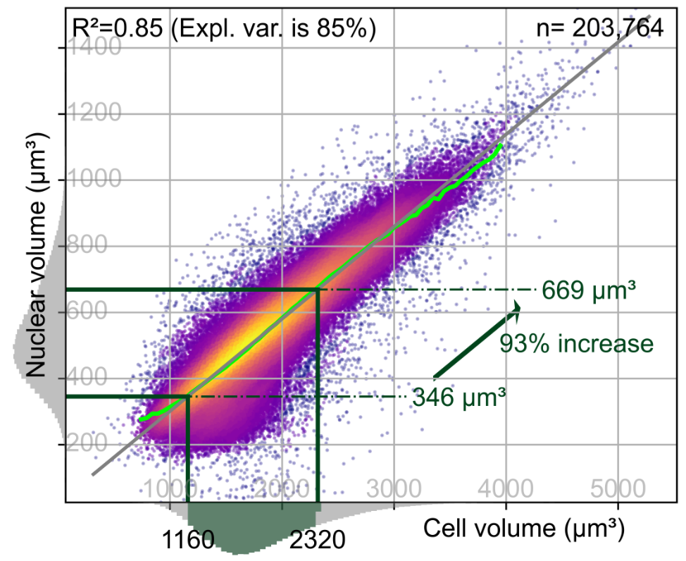

# StemCellOrganelleSizeScaling
Python repository for organelle size scaling analyses and figures of the stem cell variance project, as outlined in the manuscript: “Robust integrated intracellular organization of the human iPS cell: where, how much, and how variable?”. 

---

## Brief overview

Statistical associations between volumes and areas of cells, nuclei and structures show how strongly these metrics are coupled to each and how they scale with respect to each other. Size scaling analyses and figure creation were implemented in Python 3.7.7. Important numerical, statistical and visualization libraries that were also used include matplotlib 3.3.3, numpy 1.18.5, pandas 1.0.5, scikit-image 0.17.2, scikit-learn 0.23.1, scipy 1.5.0, seaborn 0.10.1, statsmodels 0.11.1.
